# Coach IA pour les ouvertures d'échecs (FFE × Cavalier Data)

[](https://github.com/richardhugou/p13-agent-ia-echecs/actions)
[](https://www.python.org/)
[](https://github.com/astral-sh/uv)
[](https://angular.io/)
[](https://github.com/langchain-ai/langgraph)
[](https://milvus.io/)

> **Preuve de concept (POC)** d'un agent conversationnel interactif conçu pour accompagner les jeunes espoirs de la Fédération Française des Échecs (FFE) dans l'apprentissage autonome et l'entraînement de leur répertoire d'ouvertures.

---

## 1. Contexte & Problématique

La Fédération Française des Échecs compte **60 000 licenciés**, dont environ 60 % de jeunes espoirs, pour seulement quelques centaines d'entraîneurs qualifiés sur le territoire. Le goulot d'étranglement est humain : impossible d'offrir un suivi individualisé quotidien le soir ou entre les rondes de tournoi.

**Le cas d'usage cible : Léa, 12 ans**  
Léa prépare son prochain tournoi et souhaite travailler son répertoire sur la Partie Italienne le soir. Son entraîneur n'étant pas disponible, l'agent agit comme un répétiteur interactif 24/7 pour :
1. **Jouer** : proposer les coups recommandés par la théorie des maîtres.
2. **Expliquer** : expliciter les plans stratégiques en citant des sources documentaires fiables.
3. **Conseiller** : recommander des vidéos pédagogiques ciblées.
4. **Évaluer** : analyser objectivement toute position hors théorie via Stockfish.

---

## 2. L'Application en Action : Frontend & API Backend

L'application associe une interface échiquéenne interactive (Angular 17) et une API REST asynchrone (FastAPI) documentée sous OpenAPI 3.1 :

| Frontend Angular 17 (Échiquier interactif & Conseils) | Backend FastAPI (Documentation interactive `/docs`) |
|:---:|:---:|
|  | 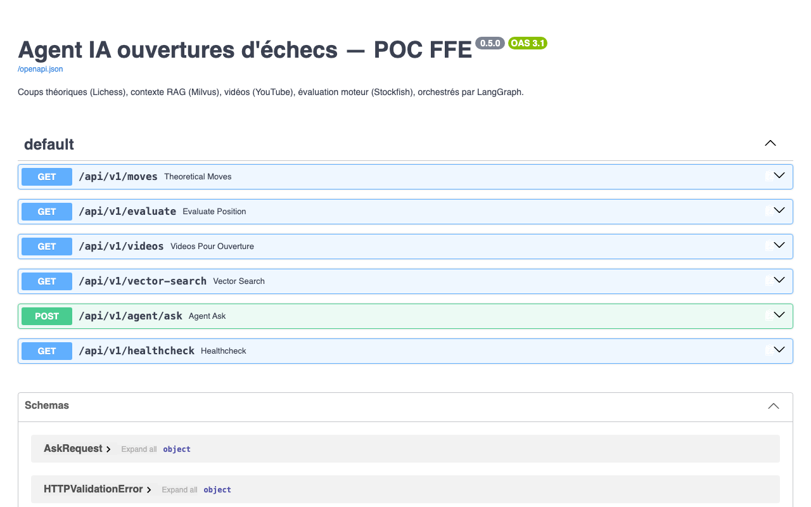 |

- **Documentation OpenAPI (Swagger)** : endpoints exposés sous `/docs` (`/api/v1/moves`, `/evaluate`, `/videos`, `/vector-search`, `/agent/ask`).
- **Démonstration en vidéo (~4 min)** : [Lien vidéo Loom](https://www.loom.com/share/d9b9362a60d74c838f022c29f307d811).

---

## 3. Parcours Utilisateur

```
[1. Choix du camp] ──► [2. Jeu théorique] ──► [3. Conseils sourcés] ──► [4. Déviation moteur]
     (Blancs/Noirs)       (Réplique auto maîtres)    (Synthèse RAG + Vidéo)       (Évaluation Stockfish)
```

| 1. Orientation & Choix du camp | 2. Jeu théorique interactif | 3. Conseils sourcés à la demande |
|:---:|:---:|:---:|
| 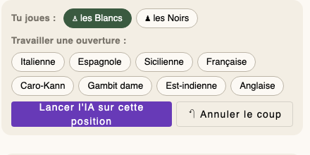 | 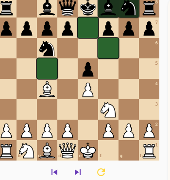 | 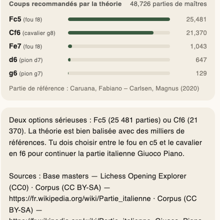 |
| L'élève sélectionne les Blancs ; l'échiquier s'oriente immédiatement et active le répertoire Italien. | L'élève joue 1.e4 ; l'agent réplique avec le coup maîtres le plus fréquent (1...e5, 2.Cf3 Cc6). | À 3.Fc4, « Demander à Chessbot » affiche flèches, coups maîtres, synthèse RAG et vidéo YouTube. |

4. **Déviation Stockfish** : Sur un coup hors répertoire (ex: `4.g4?!`), bascule immédiate vers Stockfish 16 avec évaluation chiffrée (-1,47 cp).

*Principe directeur : les faits proviennent des moteurs spécialisés, le LLM intervient uniquement pour la formulation.*

---

## 4. Architecture Logicielle & Déterminisme

Le système sépare rigoureusement le calcul déterministe et la génération de langage : **les faits proviennent des moteurs spécialisés, le LLM intervient uniquement pour la formulation pédagogique.**

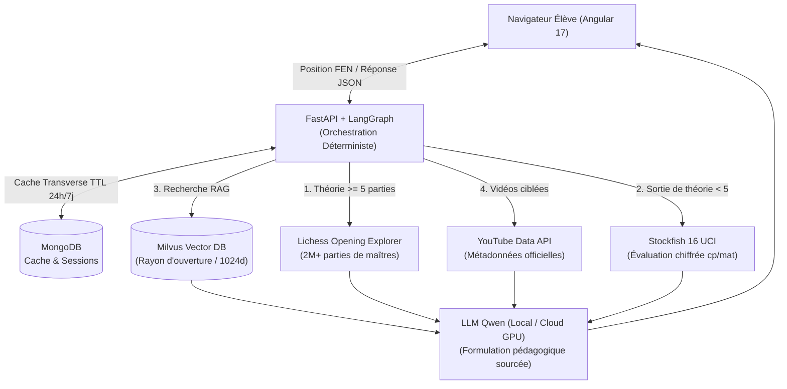

- **Clé pivot FEN** : Notation Forsyth-Edwards standardisée (`FEN`) transmise sans ambiguïté entre tous les modules.
- **Milvus vs MongoDB** : **Milvus** stocke la connaissance vectorisée (HNSW / cosinus) ; **MongoDB** assure la mise en cache transverse et la persistance des sessions.
- **Orchestration déterministe (LangGraph)** :

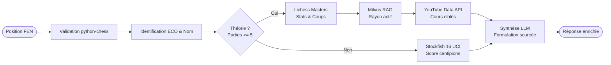

---

## 5. Données & Pipeline ETL

**4 sources documentaires complémentaires** :
- **Référentiel des ouvertures** : nomenclature et codes ECO officiels.
- **Lichess Explorer** : base de 2 M+ parties et statistiques de victoires des maîtres.
- **Wikipédia / Wikibooks** : corpus encyclopédique structuré en fiches synthétiques.
- **YouTube** : métadonnées et horodatages de vidéos pédagogiques officielles.

**Pipeline ETL rejouable et idempotent** :
`Extraction (manifeste signé corpus.yml) -> Nettoyage -> Fiches structurées -> Vecteurs 1024d -> Milvus`

**Corpus validé** : **3 251 pages disponibles $\rightarrow$ 161 retenues $\rightarrow$ 477 fiches** (95 positions FEN de référence, 0 échec de calcul).

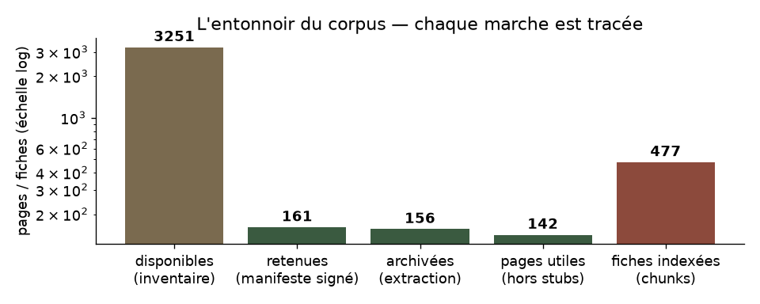

---

## 6. Recherche Sémantique & Base Vectorielle

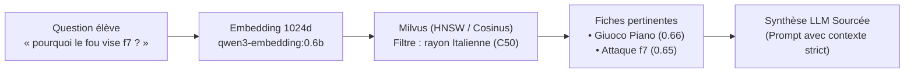

- **Espace vectoriel unifié** : Modèle multilingue `qwen3-embedding:0.6b` (1024 dimensions) alignant les concepts français et anglais.
- **Règle des rayons signés** : Recherche restreinte au rayon actif de l'ouverture pour éviter les interférences hors périmètre.
- **Seuil filet de sécurité (`RAG_SCORE_MIN = 0.58`)** : Garantie mathématique d'abstention sur les requêtes pièges (5/5 pièges bloqués, notebooks 05 et 07).
- **Performances** : Recherche vectorielle exécutée en **7 à 11 ms** (p95) avec une séparation sémantique cible/hors-sujet portée de 0,29 à **0,50**.

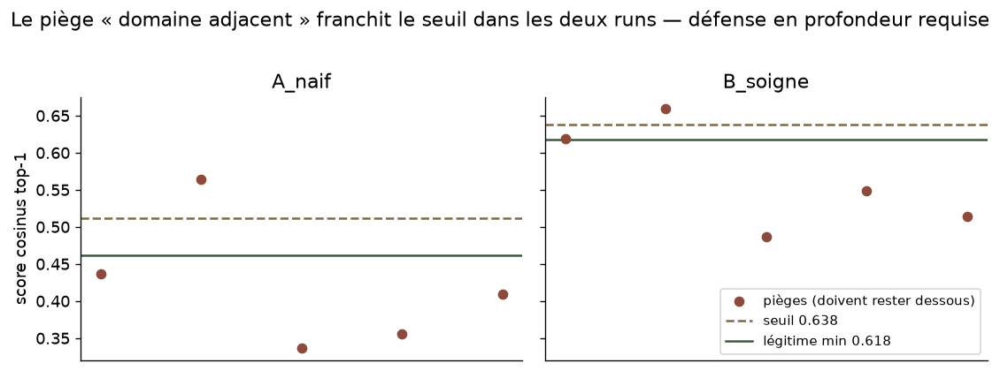

---

## 7. Performances Mesurées

| Indicateur clé | Objectif | Résultat mesuré | Preuve / Méthode |
|---|---|---|---|
| **Coups illégaux en sortie** | 0 | **0 sur 56 testés** | Contrôle systématique via `python-chess` |
| **Qualité RAG (Recall@5)** | $\ge 0,80$ | **1,0** | Gold Set 25 questions tracé sous MLflow |
| **Abstention sur les pièges** | 5 / 5 | **5 / 5 requêtes bloquées** | Rayon signé + seuil filet `0.58` |
| **Réponses avec sources valides** | 100 % | **100 %** | Garanti par construction du pipeline RAG |
| **Recherche vectorielle Milvus** | $< 100\text{ ms}$ | **7 à 11 ms** (p95) | Index HNSW Milvus |
| **Latence globale (Cloud GPU T4)** | p95 $< 8\text{ s}$ | **1,81 s (p50) · 2,41 s (p95)** | Banc mesuré sur Hugging Face Spaces |
| **Latence globale (Local CPU)** | p95 $< 8\text{ s}$ | **2,69 s (p50) · 6,35 s (p95)** | Banc local avec Ollama CPU |
| **Coût d'API LLM** | 0,00 € | **0,00 €** | Modèles open source servis localement / GPU |

| Latences mesurées (Scénario nominal & déviation) | Tracking et évaluation A/B sous MLflow |
|:---:|:---:|
| 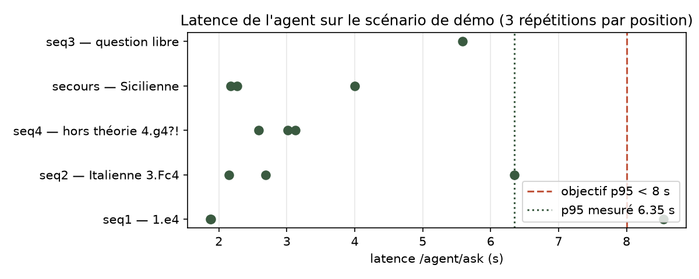 | 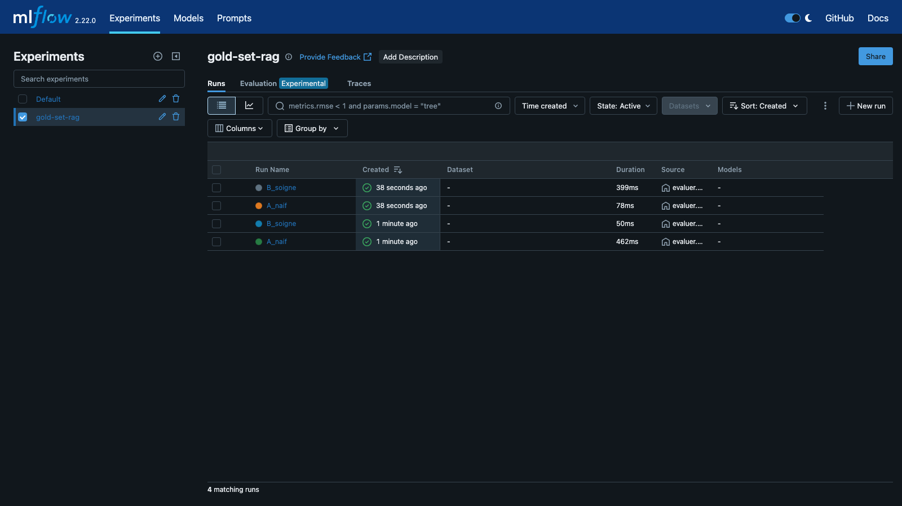 |

---

## 8. Limites du Système & Analyse Technique

### 1. Périmètre & Fonctionnalités Assumées du POC
- **Périmètre des répertoires** : 8 ouvertures couvertes dans le manifeste signé (`etl/corpus.yml`).
- **Authentification** : Aucune couche d'authentification implémentée (accès ouvert pour le banc d'essai et l'entraînement autonome).
- **Vitrine en ligne dégradée assumée** : La vitrine hébergée en ligne est une variante volontairement allégée (gabarit sans LLM lourd, sans cache persistant) ; la version complète avec inférence LLM et cache s'exécute en local ou sur Space GPU T4 à l'usage.
- **Analyse vidéo (Partie 2)** : Le système d'analyse vidéo par computer vision constitue une étude d'ingénierie formalisée, non implémentée dans le code du POC (voir dossier `livrables/`).

### 2. Diagnostic Technique : Lenteur au Démarrage & Première Requête (Cold Start)
L'analyse des logs d'exécution sur instance GPU Cloud met en évidence les mécanismes réels de latence initiale :

1. **Démarrage FastAPI rapide** : Uvicorn et FastAPI démarrent instantanément (`Application startup complete` en < 1 s). FastAPI n'est pas le goulot d'étranglement.
2. **Coût du Cold Start LLM (Ollama / llama.cpp)** :
   - À la première requête IA, Ollama instancie `llama-server`.
   - Chargement complet du modèle Qwen (4,66 milliards de paramètres, 34/34 couches offloadées sur GPU, ~2,5 Go VRAM, allocation contexte 4096, KV cache 128 Mo, buffers CUDA, warm-up).
3. **Anomalie de Timeout Client / Proxy (HTTP 499)** :
   - Si le client ou le proxy intermédiaire applique un timeout strict (~30 s) avant la fin du warm-up initial, la connexion est fermée (`client connection closed before llama-server finished loading`).
   - Ollama avorte le chargement (`aborting load`), ce qui force le système à réinitialiser le cycle de chargement sur la requête suivante.
4. **Vérification VRAM** : La GPU NVIDIA T4 (15 Go) dispose de plus de 12 Go libres après chargement (projection 2,7 Go) ; le modèle ne sature pas la mémoire.
5. **Mode dégradé MongoDB** : En cas d'indisponibilité du cache (ex: port inaccessible), le système bascule gracieusement après un timeout de 1,5 s sans bloquer le graphe.
6. **Solution d'ingénierie cible** : Préchargement explicite du modèle (`keep_alive: -1`) et exécution d'un warm-up synthétique dès le hook `lifespan` au démarrage de FastAPI.

---

## 9. Déploiement Cible, Dimensionnement & Coûts

### 1. Architecture de Déploiement Découplée

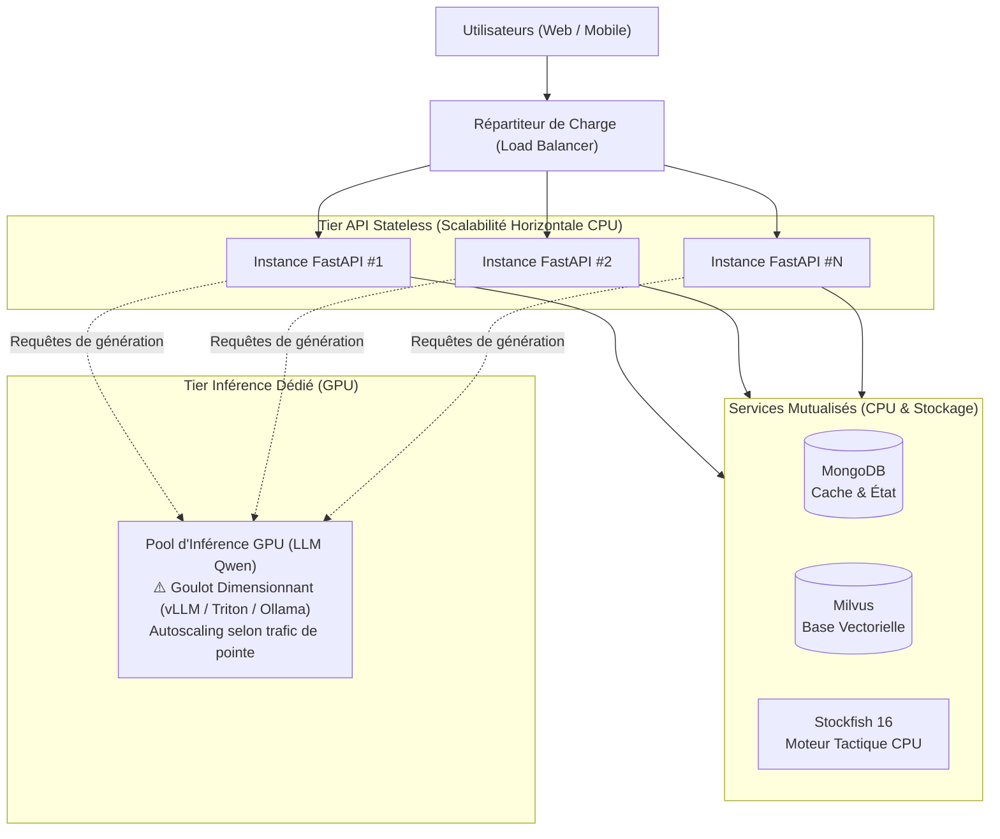

- **Principe architectural** : Les instances API FastAPI stateless scalent horizontalement sur CPU à coût très faible ; le pool GPU d'inférence est isolé et dimensionné selon la concurrence en heure de pointe.

### 2. Modélisation de la Charge (Base FFE : 60 000 licenciés)

*Hypothèse d'utilisation : 30 analyses / utilisateur / mois.*

| Scénario d'adoption | Utilisateurs actifs | Volume mensuel estimé | Débit moyen estimé | Dimensionnement GPU cible |
|---|---|---|---|---|
| **Scénario 1 %** | 600 utilisateurs | 18 000 req / mois | ~0,25 req / min | Pool GPU partagé |
| **Scénario 5 %** | 3 000 utilisateurs | 90 000 req / mois | ~1,25 req / min | Pool GPU dimensionné sur trafic de pointe |
| **Scénario 10 %** | 6 000 utilisateurs | 180 000 req / mois | ~2,50 req / min | Pool GPU avec politique d'autoscaling |

*Règle d'ingénierie : Le dimensionnement GPU se calcule sur le volume simultané en heure de pointe (concurrence), et non sur la moyenne mensuelle lissée.*

### 3. Coûts de Fonctionnement Estimés (Scénario 5 % / 3 000 users)

| Poste d'infrastructure | Rôle technique | Estimation mensuelle |
|---|---|---|
| **Inférence GPU** | Pool GPU (instances T4 / L4 à l'usage) | ~150 à 280 € / mois |
| **API Backend** | Conteneurs API FastAPI stateless (CPU / RAM) | ~30 à 50 € / mois |
| **Bases de données** | Instances managées Milvus + MongoDB | ~50 à 80 € / mois |
| **Stockage & Monitoring** | Logs, métriques, sauvegardes | ~20 € / mois |
| **APIs Externes** | Modèles open source + YouTube Data API officielle | **0,00 €** |
| **TOTAL OPEX** | **Production dimensionnée pour 3 000 utilisateurs** | **~250 à 430 € / mois** |

- **Investissement Build (POC)** : ~25 à 30 jours-homme (stack 100 % open source, zéro coût de licence propriétaire).

---

## 10. YouTube dans le POC vs Étude d'Analyse Vidéo (Partie 2)

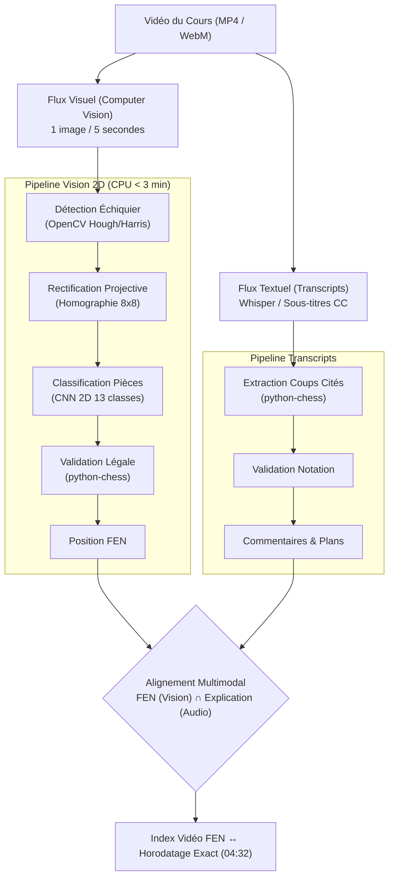

| Dimension | YouTube dans le POC (Implémenté) | Analyse Vidéo Automatique (Étude Partie 2) |
|---|---|---|
| **Direction** | Position $\rightarrow$ Ouverture $\rightarrow$ Vidéo globale | Vidéo $\rightarrow$ Images $\rightarrow$ FEN $\rightarrow$ Timestamp exact (04:32) |
| **Technologie** | Requête API YouTube Data v3 (titre, URL, miniature) | Computer Vision 2D (OpenCV + CNN) + Transcripts (Whisper) |
| **Compute** | Requête HTTP REST (< 20 ms via cache MongoDB) | Inférence CPU (< 3 min / vidéo) |
| **Arbitrage MVP** | 3 vidéos recommandées par ouverture | Échiquier 2D uniquement (3D physique *ChessReD* repoussée en V2) |
| **Chiffrage pilote** | Inclus dans le POC | Pilote 100 vidéos : 30–40 j-h, 15–20 k€ build, ~0,10–0,15 € / vidéo |

---

## 11. Démarrage Rapide (Local)

### Prérequis
- **Docker Desktop** (avec Docker Compose).
- **uv** (gestionnaire de packages Python standard du projet).
- Optionnel : **Ollama** sur l'hôte (`qwen3.5:4b`, `qwen3-embedding:0.6b`).

### Lancement en une commande

```bash
git clone https://github.com/richardhugou/p13-agent-ia-echecs.git
cd p13-agent-ia-echecs
./demarrer.sh
```

Le script exécute le cycle complet :
1. Démarrage d'Ollama sur l'hôte et vérification des modèles.
2. Initialisation de la configuration `.env`.
3. Construction et démarrage des conteneurs Docker (`docker compose up -d --build`).
4. Attente active des healthchecks de l'API et de Milvus.

*Temps de démarrage mesuré lors d'une installation fraîche : **2 min 09**.*

### URLs des services
- **Frontend Angular** : http://localhost:4200
- **API Swagger FastAPI** : http://localhost:8000/docs
- **Serveur MLflow** : http://localhost:5001

---

## 12. Structure du Dépôt & Livrables

```
├── backend/          # API FastAPI, moteur Stockfish, services métier, tests pytest
├── frontend/         # Application Angular 17, composant échiquier, panneau coach
├── etl/              # Pipeline ETL (manifeste corpus.yml, extraction, vectorisation Milvus)
├── evaluation/       # Gold Set 25 questions, scripts d'évaluation RAG A/B, tracking MLflow
├── notebooks/        # 7 notebooks Jupyter de recherche, d'EDA et de benchmarking
├── space/            # Configuration Docker et scripts de déploiement Hugging Face Spaces GPU T4
├── livrables/        # Présentation de soutenance (PDF/HTML), note d'analyse vidéo, scripts de build
└── README.md         # Point d'entrée officiel du projet
```

### Documents de Soutenance
- [Support de présentation officiel (PDF 19 diapos)](livrables/rendu/presentation-soutenance.pdf)
- [Support de présentation au format HTML](livrables/rendu/presentation-soutenance.html)
- [Note d'ingénierie — Analyse Vidéo & Architecture MCP (PDF)](livrables/rendu/Mettez_en_place_un_agent_IA_Hugou_Richard/Hugou_Richard_3_note_analyse_video_082026.pdf)
- [Archive officielle de soumission (.zip)](livrables/rendu/Mettez_en_place_un_agent_IA_Hugou_Richard.zip)

---

## 13. Auteur & Licence

- **Auteur** : Richard Hugou — *IA Engineer, Cavalier Data*
- **Partenariat** : Projet OpenClassrooms × Fédération Française des Échecs
- **Code source** : MIT License
