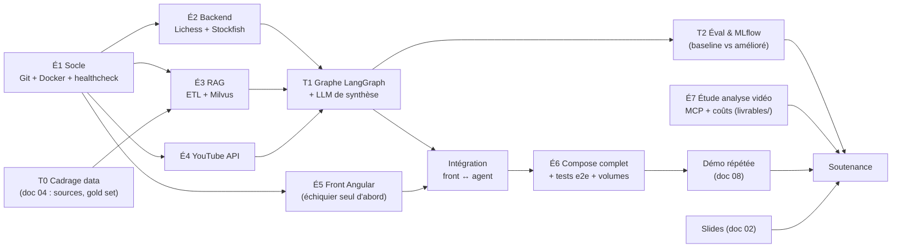

# 03 — Checklist maître, interdépendances & planning 2 semaines

## 1. Graphe de dépendances entre étapes

**Lectures clés du graphe :**
- **Chemin critique** : É1 → É2 → T1 → I1 → É6 → Démo. Tout retard ici décale la fin.
- É3 (RAG) et É4 (YouTube) sont **parallélisables** avec É2 — mais T0 (choix des sources + gold set, doc 04) doit être figé **avant** de lancer l'ETL É3.
- É7 (étude partie 2) ne dépend d'**aucun code** : c'est la variable d'ajustement des jours creux (attentes de build, quotas épuisés).
- É5 se commence tôt en mode « échiquier local sans backend » ; seule l'intégration I1 dépend de l'agent.

## 2. Checklist par étape (avec critère de sortie = « gate »)

### T0 — Cadrage data (avant tout code)
- [ ] Sources retenues et comptées (exécuter le plan d'inventaire du doc 04 §3.1)
- [ ] Liste des 8–10 ouvertures cibles figée (avec codes ECO)
- [ ] Gold set de 25 questions rédigé (doc 04 §6)
- [ ] Licences vérifiées par source
- **Gate T0** : le tableau « chiffres récap » du doc 04 §7 est rempli colonne « attendu ».

### É1 — Socle projet
- [ ] Dépôt Git initialisé, README minimal, `.gitignore` (Python, Node, `.env`)
- [ ] Arborescence `backend/`, `frontend/`, `etl/`, `docs/`
- [ ] `.env.example` complet dès le premier jour (voir livrables/README-repo-template.md)
- [ ] Dockerfile backend avec version Python **3.12 épinglée** (le Python système 3.9.6 est trop vieux pour LangGraph 1.x — voir doc 06 §2)
- [ ] `docker compose` : FastAPI « hello » + route `/api/v1/healthcheck`
- [ ] Ports vérifiés sans conflit local : 4200, 8000, 19530, 9091, 27017, (5000 MLflow)
- **Gate É1** : healthcheck OK depuis le navigateur après `docker compose up` sur clone frais.

### É2 — Cœur métier (Lichess + Stockfish)
- [ ] Validation FEN + coups légaux via python-chess (module service séparé de l'API)
- [ ] Endpoint coups théoriques (explorer Lichess) — **FEN en query param, pas en path** (doc 05 §3)
- [ ] Endpoint évaluation Stockfish (centipawns + meilleure ligne, profondeur configurable)
- [ ] Cache MongoDB des réponses Lichess (TTL 24 h) + backoff 60 s sur HTTP 429
- [ ] Timeouts explicites sur tous les appels externes
- **Gate É2** : les 2 endpoints répondent via Swagger pour la position italienne ET pour une position hors théorie.

### É3 — RAG (dépend de T0)
- [ ] ETL : extraction corpus → nettoyage → chunking → embeddings → Milvus (règles doc 04 §4)
- [ ] Rapport EDA généré (chiffres + figures du doc 04 §3)
- [ ] Collection Milvus créée (schéma doc 04 §5), index HNSW/cosine
- [ ] Endpoint `/vector-search` avec top-k paramétrable
- [ ] Mesure recall@5 sur le gold set → **loggée dans MLflow (run « baseline »)**
- **Gate É3** : recall@5 ≥ 0,8 sur le gold set, ou écart documenté + plan d'amélioration.

### É4 — YouTube
- [ ] Clé API créée, quota vérifié (10 000 unités/j ; 1 recherche = 100 unités)
- [ ] Endpoint vidéos par ouverture ; requêtes construites « nom + chess opening + tutorial »
- [ ] Cache MongoDB (TTL 7 j) — objectif : ~30 recherches réelles au total, le reste servi du cache
- [ ] Filtres pertinence (durée, langue, embeddable) + cas « aucune vidéo » géré
- **Gate É4** : 3 ouvertures testées → liens/embeds valides, 0 appel API sur second hit (cache).

### T1 — Agent LangGraph + LLM
- [ ] État du graphe défini (doc 05 §2) ; nœuds : validation → identification ouverture → routeur théorie/moteur → RAG → vidéos → synthèse
- [ ] Arête conditionnelle « théorie vs hors-théorie » (seuil : nb de parties explorer > N)
- [ ] LLM de synthèse branché (décision D1, doc 05 §6) — le LLM ne choisit **jamais** un coup
- [ ] Gestion d'erreur par nœud (fallback dégradé : répondre sans vidéo plutôt que planter)
- [ ] Traces activées (MLflow autolog) + compteur tokens/coût
- **Gate T1** : pour 5 positions de test, le bon chemin du graphe est emprunté (vérifié dans les traces) et 0 coup illégal en sortie.

### É5 — Front Angular
- [ ] Angular CLI installé (absent sur la machine — voir audit doc 06 §1)
- [ ] Échiquier ngx-chessboard fonctionnel en standalone (repo OC `material-chessboard`)
- [ ] Panneau agent : coups suggérés / contexte / vidéos / éval — avec états de chargement et d'erreur
- [ ] Service HTTP + gestion CORS côté API
- **Gate É5** : jouer des coups met à jour le FEN affiché, sans backend.

### I1 — Intégration front ↔ agent
- [ ] Chaque coup joué déclenche l'appel agent (avec anti-spam : débounce/annulation des requêtes obsolètes)
- [ ] Synchronisation FEN board ↔ backend vérifiée dans les deux sens
- **Gate I1** : le scénario de démo (doc 08) passe de bout en bout à la main.

### É6 — Compose complet + e2e
- [ ] Tous services orchestrés, `depends_on` avec healthchecks (Milvus est long à démarrer)
- [ ] Volumes persistants Mongo + Milvus déclarés, testés par recréation des conteneurs
- [ ] Variables d'env centralisées ; aucune clé en dur ni commitée
- [ ] Test « installation fraîche » : clone → `.env` → `docker compose up` → app utilisable < 5 min
- [ ] README du dépôt finalisé (livrables/README-repo-template.md)
- **Gate É6** : test installation fraîche réussi 2 fois de suite, données persistantes après `down`/`up`.

### T2 — Évaluation & récit « avant/après »
- [ ] Run MLflow « baseline » vs run « amélioré » (paramètres de chunking/k différents)
- [ ] Tableau de métriques rempli : recall@5, MRR, latence p50/p95 par nœud, coût/interaction
- [ ] Captures MLflow pour le slide 12
- **Gate T2** : le slide 12 n'a plus aucun [MESURE].

### É7 — Étude analyse vidéo (parallélisable dès J3)
- [ ] Note 8–10 pages complétée (livrables/note-benefices-limites-SQUELETTE.md)
- [ ] Schéma MCP finalisé (livrables/schema-architecture-mcp.md)
- [ ] Étude de coûts avec 3 scénarios (livrables/etude-faisabilite-couts.md)
- **Gate É7** : relecture croisée — chaque limite citée a une mitigation ou une alternative.

### Final
- [ ] Fiche d'autoévaluation cochée (livrables/fiche-autoevaluation.md)
- [ ] Slides finalisés, chiffres sourcés, démo répétée 2×, plan B enregistré
- [ ] Dépôt propre : historique lisible, pas de secrets, tag `v0.1-poc`

## 3. Planning indicatif J1 → J10 (2 semaines ouvrées)

| Jour | Matin | Après-midi | Gate visée |
|---|---|---|---|
| J1 | T0 cadrage data (inventaire, gold set) | É1 socle Git/Docker/healthcheck | T0, É1 |
| J2 | É2 Lichess (+ cache, 429) | É2 Stockfish + tests Swagger | É2 |
| J3 | É3 ETL extraction + nettoyage | É3 chunking + embeddings + rapport EDA | — |
| J4 | É3 Milvus + `/vector-search` + recall baseline | É4 YouTube + cache | É3, É4 |
| J5 | T1 graphe LangGraph (routeur théorie/moteur) | T1 synthèse LLM + traces | — |
| J6 | T1 durcissement erreurs/fallbacks | É5 front : échiquier standalone | T1 |
| J7 | É5 panneau agent + services HTTP | I1 intégration + CORS | É5 |
| J8 | I1 fin + scénario démo à la main | É6 compose complet + volumes | I1 |
| J9 | É6 test installation fraîche ×2 | T2 runs MLflow avant/après + captures | É6, T2 |
| J10 | É7 finalisation étude + relecture | Slides + répétition démo ×2 | É7, final |

**Buffers** : É7 se rédige en pointillé dès J3 (pendant les builds/downloads). Si dérapage > 1 jour sur le chemin critique : couper d'abord le nombre d'ouvertures (10 → 5), puis le streaming vidéo (liens simples), jamais la boucle théorie/Stockfish ni l'éval.

## 4. Parking lot (idées à ne PAS faire dans le POC — à citer en « perspectives »)
- Rerank des résultats Milvus par cross-encoder ; hybrid search (BM25 + vecteurs).
- Lichess cloud-eval comme cache d'évaluations avant Stockfish local.
- Checkpointer LangGraph → MongoDB (reprise de session).
- Mode « quiz » : l'agent interroge l'élève au lieu de répondre.
- Profils par niveau Elo (vocabulaire adapté).
