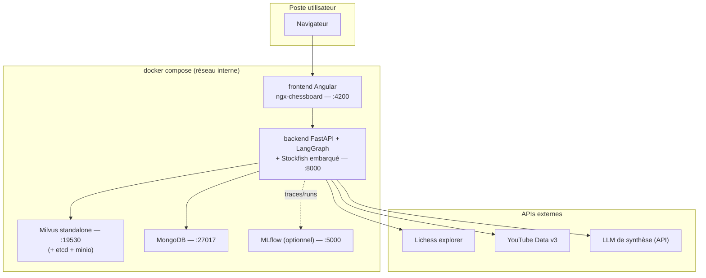
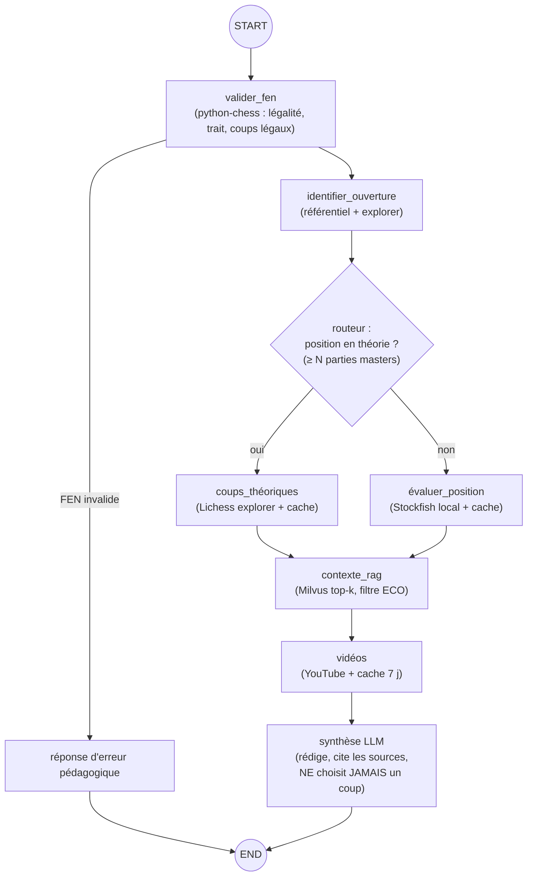

# 05 — Architecture technique : services, graphe LangGraph, contrats, choix justifiés

## 1. Vue d'ensemble des services (docker compose)

- **Stockfish vit dans l'image backend** (binaire arm64 installé au build) : pas de service séparé à orchestrer — simplicité POC.
- Volumes persistants : `mongo_data`, `milvus_data` (+ etcd/minio), `mlflow_data`.
- Seuls 4200 (et 8000 pour Swagger) sont exposés à l'hôte ; le reste vit dans le réseau interne.

## 2. Le graphe LangGraph (le cœur à savoir dessiner au tableau)

**État partagé (champs principaux)** : `fen`, `legal_moves`, `opening {eco, name}`, `in_theory (bool)`, `theory_moves[]`, `engine_eval {cp, best_line}`, `rag_chunks[]`, `videos[]`, `answer`, `errors[]`, `question_utilisateur?`

**Règles de conception à défendre :**
1. **Le LLM n'est pas la source de vérité** : coups = Lichess, éval = Stockfish, faits = RAG. Le LLM met en forme et pédagogise. (Justification : enseignements Kaggle Game Arena — les LLM seuls produisent coups illégaux et blunders.)
2. **Chaque nœud a un fallback** : Lichess KO → on continue avec RAG+Stockfish ; YouTube KO → réponse sans vidéos ; Milvus KO → réponse théorie seule + avertissement. L'agent dégrade, ne plante pas.
3. **Tout passage est tracé** (nœud, durée, tokens) → MLflow ; c'est ce qui prouve « mon agent choisit des outils pertinents » (fiche d'autoéval).
4. Le routeur est **déterministe** (seuil sur données explorer), pas un choix LLM : plus testable, plus défendable. Le LLM intervient en aval, et en amont uniquement pour comprendre une question libre de l'utilisateur (« pourquoi 3.Fc4 ? » → intention → mêmes nœuds).

## 3. Contrats d'API (FastAPI)

| Endpoint | Méthode | Entrée | Sortie (résumé) |
|---|---|---|---|
| `/api/v1/healthcheck` | GET | — | statut + versions services |
| `/api/v1/moves` | GET | `fen` en **query param** | ouverture identifiée, coups théoriques avec stats (W/D/L, nb parties), parties de référence |
| `/api/v1/evaluate` | GET | `fen` en query, `depth?` | éval centipawns (ou mat en N), meilleure ligne, profondeur, temps de calcul |
| `/api/v1/vector-search` | GET/POST | `q` ou `fen`, `k`, `eco?` | top-k chunks {texte, score, source_url, opening} |
| `/api/v1/videos` | GET | `opening` | vidéos {id, titre, chaîne, durée, url, embeddable} |
| `/api/v1/agent/ask` | POST | `{fen, question?, session_id}` | réponse synthétique + blocs structurés (coups/contexte/vidéos/éval) + sources |

**Piège technique à connaître (question jury quasi garantie)** : le brief propose `/moves/{fen}`, mais un FEN contient des **espaces et des `/`** → en path param il faut l'encoder URL (%20, %2F) et certains serveurs re-décodent mal. Décision : **FEN en query param** (ou body POST) partout ; on garde la route path documentée en alias pour coller à l'énoncé si exigé.

## 4. Qui stocke quoi (répartition MongoDB / Milvus — question jury classique)
- **Milvus** : uniquement les vecteurs + méta de filtrage (recherche sémantique). Ce n'est pas une base d'application.
- **MongoDB** : tout le reste — caches d'APIs (quotas !), sessions, runs d'éval, métadonnées vidéos. Document store = schéma souple pour un POC qui bouge.
- Clé de jointure transverse : le **FEN normalisé** (et `eco` pour l'agrégat ouverture).

## 5. Choix techno justifiés (tableau à connaître par cœur)

| Brique | Choix | Pourquoi | Alternatives écartées (et pourquoi) |
|---|---|---|---|
| Orchestration agent | **LangGraph 1.x** | Graphe d'états explicite, arêtes conditionnelles = notre routeur théorie/moteur ; checkpointing ; traces ; imposé par le brief et pertinent | Chaîne LangChain simple (pas de branchement d'état propre) ; CrewAI/AutoGen (multi-agents inutile ici) ; code maison (réinventer le checkpointing) |
| API | **FastAPI** | Async natif (appels externes parallèles), Swagger auto pour la démo, standard | Flask (pas d'async natif, pas de schéma auto) |
| Base vectorielle | **Milvus standalone** | Imposé ; index HNSW performant ; filtres scalaires (ECO) ; scalabilité au-delà du POC | pgvector (très bien mais pas dans le brief), Chroma/FAISS (pas de vrai service réseau/persistance gérée), Milvus Lite (dev seulement, pas conforme au compose demandé) |
| Embeddings | **Qwen3-Embedding-0.6B** (1024 d) | Multilingue FR/EN (corpus mixte !), léger (~0,6 Md params), MRL, suggéré par le brief | MiniLM-L6 (anglais surtout, 384 d) ; e5-small multilingue (correct mais moins bon) ; embeddings API payants (dépendance + coût inutile à cette échelle) |
| LLM de synthèse | **Décision D1** — reco : Claude Haiku 4.5 via API | Rapide, bon marché (~1 $/M in, 5 $/M out ⚠️ vérifier au jour J), tool-use fiable ; budget POC estimé **< 5 €** | GPT-4o-mini (équivalent, même logique) ; Ollama local (0 €, mais 16 Go RAM partagés avec Milvus+Mongo → risqué, qualité FR moindre) |
| Docs/BDD app | **MongoDB** | Imposé ; caches TTL natifs ; schéma souple | PostgreSQL (aurait pu tout faire avec pgvector — à dire en ouverture si question) |
| Front | **Angular + ngx-chessboard** | Imposé (repo OC fourni) | — |
| Moteur | **Stockfish** (GPLv3, >3600 Elo) | Référence absolue, local, gratuit | lc0 (GPU requis), API cloud-eval (dépendance réseau ; gardée en bonus cache) |

## 6. Décisions ouvertes à trancher AVANT de coder (avec le mentor si besoin)

| # | Décision | Options | Reco par défaut |
|---|---|---|---|
| **D1** | LLM de synthèse | Haiku 4.5 / GPT-4o-mini / Ollama local | Haiku 4.5 (ou GPT-4o-mini) — budget < 5 €, qualité FR stable |
| **D2** | MLflow en service compose ou runs locaux seulement | service :5000 / local files | Service compose (capture d'écran pour slide 12 + preuve « prod-like ») |
| **D3** | Corpus RAG | Wikibooks EN / Wikipédia FR / mix | Mix (option C doc 04 §2.3) — FR pour la pédagogie, EN pour la granularité |

## 7. Séquence type (à raconter en démo, 30 s)
1. L'élève joue 3.Fc4 sur l'échiquier → le front envoie le FEN à `/agent/ask`.
2. `valider_fen` confirme la légalité → `identifier_ouverture` : Partie Italienne (C50).
3. Routeur : ≥ N parties masters → branche **théorie** : coups Fc5/Cf6 avec stats.
4. RAG Milvus (filtre C50) : idées du Giuoco Piano + partie de référence historique.
5. Vidéos depuis le cache. 6. Synthèse LLM : réponse structurée + sources citées → panneau Angular.
