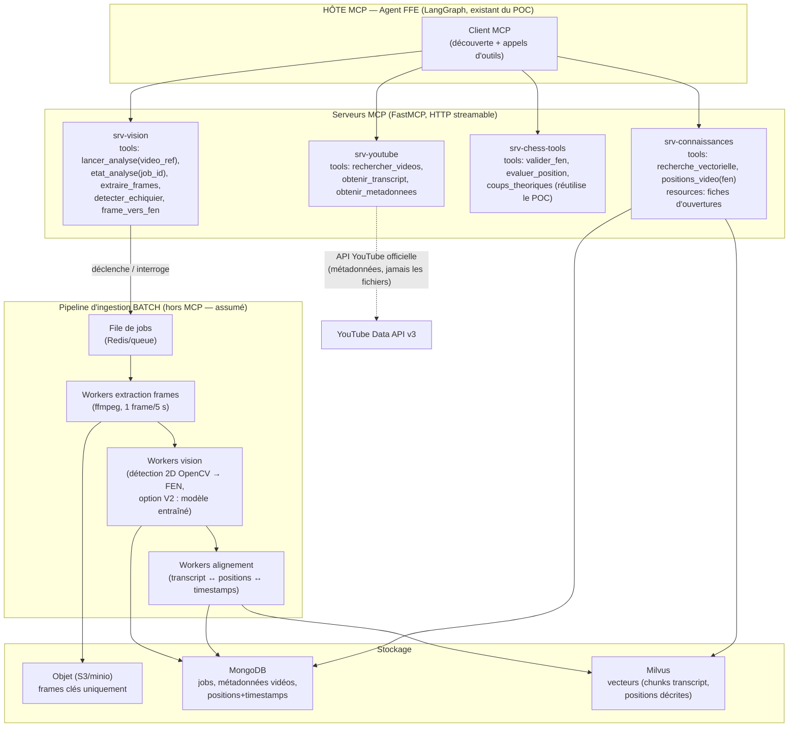

# [LIVRABLE] Schéma d'architecture technique — solution MCP (analyse vidéo)

> **Comment compléter** : ce document est quasi final ; il reste à (1) valider les noms/périmètres des serveurs MCP, (2) exporter le schéma mermaid en image pour la note et le slide 14, (3) remplir les [CHIFFRE] depuis l'étude de coûts.

## 1. Rappel MCP en 5 lignes (pour la note et pour le jury)
Le **Model Context Protocol** (standard ouvert initié par Anthropic fin 2024, adopté ensuite largement dans l'écosystème ⚠️ à sourcer au moment de la rédaction) normalise la façon dont un agent (« hôte ») découvre et appelle des capacités externes via des **serveurs MCP** exposant trois primitives : **tools** (actions), **resources** (données lisibles), **prompts** (gabarits). Transports : stdio en local, HTTP streamable en distant. Implémentation Python de référence pour nous : **FastMCP**.

**Argument d'architecture** : chaque serveur MCP est réutilisable par n'importe quel agent futur de la FFE (pas seulement le nôtre), indépendamment du framework d'orchestration — c'est la modularité demandée.

## 2. Le schéma

## 3. Composants (tableau à intégrer dans la note)

| Composant | Rôle | Techno pressentie | Point clé |
|---|---|---|---|
| Hôte/agent | Orchestration, dialogue élève | LangGraph (existant POC) | Devient client MCP : aucun couplage direct aux implémentations |
| srv-youtube | Découverte de contenus + transcripts | FastMCP + API YouTube | Respect CGU : métadonnées/transcripts, filtre licence CC |
| srv-vision | Pilotage des analyses (asynchrone) | FastMCP | **lancer_analyse retourne un job_id** : MCP pilote, le batch exécute |
| srv-chess-tools | Validation FEN, éval, théorie | FastMCP encapsulant les services du POC | Réutilisation directe — argument fort |
| srv-connaissances | Recherche sémantique + jointure position↔vidéo | FastMCP + pymilvus/Mongo | La clé pivot reste le FEN normalisé |
| File + workers | Ingestion de masse | Redis + workers Python (ffmpeg, OpenCV) | Débit dimensionné dans l'étude ([CHIFFRE] vidéos/h/worker) |
| Stockage objet | Frames clés uniquement (pas les vidéos) | minio local / S3 prod | ~[CHIFFRE] Mo/vidéo (frames retenues seulement) |

## 4. Décisions d'architecture à défendre
1. **MCP pour l'interface, batch pour la masse** : un agent n'a pas à attendre 3 min d'analyse ; il déclenche (`lancer_analyse`) et consulte (`etat_analyse`). Honnêteté architecturale = crédibilité.
2. **On ne stocke jamais les fichiers vidéo** (CGU) : frames clés + positions + timestamps + transcripts. Le « stocke les vidéos » de la demande initiale est requalifié en « stocke les *références et produits d'analyse* des vidéos » — à expliciter dans la note.
3. **Idempotence** : une vidéo = un hash ; ré-analyse uniquement si version du pipeline change.
4. **Sécurité** : serveurs MCP derrière auth (token de service), pas d'exécution arbitraire, quotas par outil ; données en UE.
5. **Évolutivité** : passer du régime 2D (OpenCV pur, CPU) au régime 3D (modèle vision, GPU) = remplacer un worker, sans toucher ni aux serveurs MCP ni à l'agent.

## 5. Flux type (à raconter sur le slide 14)
Élève sur la position Italienne → agent appelle `positions_video(fen)` (srv-connaissances) → « cette position est expliquée à 4 min 32 dans la vidéo X (licence CC) » → lien horodaté dans l'UI. Si position inconnue → l'agent peut proposer `lancer_analyse` sur les meilleures vidéos candidates (srv-youtube) → disponible quelques minutes plus tard.
